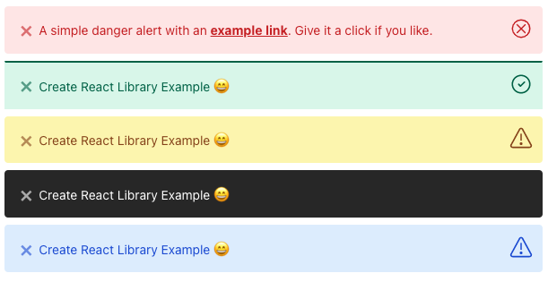

# @meksiabdou/alert-reactjs

> Alert For ReactJs


[](https://standardjs.com)


## Install

```cmd
yarn add @meksiabdou/alert-reactjs
```

```cmd
npm install @meksiabdou/alert-reactjs
```

## Props

| Property       | Type                                        | default   |
| -------------- | ------------------------------------------- | --------- |
| className      | string                                      | undefined |
| show           | boolean                                     | false     |
| type           | 'success' or 'error' or 'warning' or 'dark' | success   |
| message        | ReactNode or string                         | undefined |
| customIcon     | ReactNode                                   | undefined |
| transitionTime | number (ms)                                 | 250       |
| alertStyle     | AlertStyle                                  | undefined |
| onHide         | function                                    | undefined |

## Usage

```tsx
import React, { useState } from 'react';

import Alert from 'alert-reactjs';
import 'alert-reactjs/dist/index.css';

const Home = () => {
  const [show, setShow] = useState(false);
  const [type, setType] = useState('success');

  return (
    <Alert
      type={type}
      message={
        <span>
          A simple danger alert with an
          <a href="#" style={{ fontWeight: 700, color: 'inherit' }}>
            example link
          </a>. Give it a click if you like.
        </span>
      }
      show={show}
      onHide={() => setShow(false)}
    />
  );
};
```

## ScreensShot



## License

MIT © [meksiabdou](https://github.com/meksiabdou)
